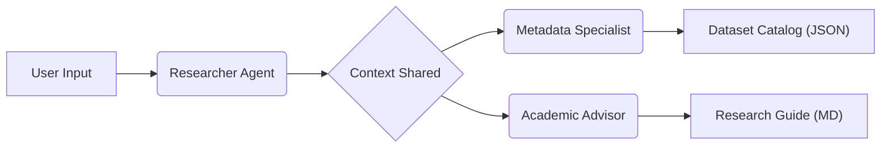

# Agentic Research Assistant

> **An autonomous multi-agent system for academic research and dataset discovery, powered by CrewAI and Google Gemini.**


## Overview
The **Agentic Research Assistant** is an agentic AI workflow designed to act as an intelligent "Data Concierge" for researchers and students. Instead of manually scouring multiple repositories (Kaggle, HuggingFace, Zenodo), this system orchestrates a crew of specialized AI agents to autonomously find, validate, and summarize high-quality open-source datasets.

It features a **Dual-Pipeline Architecture** that simultaneously produces:
1.  **Research Guide:** A human-readable markdown report summarizing the data landscape, recommending top picks, and warning of potential pitfalls.
2.  **Dataset Catalog:** A structured JSON dataset containing direct download links, file formats, and licensing metadata for immediate ingestion.

## Architecture
The system employs a sequential process manager to coordinate three specialized agents:

1.  **Data Scout:** Scours academic and public repositories (Kaggle, UCI, Government Databases) to find raw data matching the user's research topic.
2.  **Metadata Specialist:** Validates discovered links and extracts technical specifications (File Format, Size, Platform) into strict JSON schema.
3.  **Academic Advisor:** Synthesizes the findings into a strategic guide, helping the user understand which dataset is best suited for their specific thesis or project.



## Key Features
* **Multi-Agent Orchestration:** Autonomous task delegation between research, data engineering, and writing roles.
* **Streamlit UI:** Employs a user-friendly web interface for inputting research topics and viewing results in interactive tables.
* **Cost-Efficient Inference:** Optimized for **Google Gemini 2.5 Flash Lite** to operate within free-tier API constraints.
* **Strict Typing & Validation:** Implements **Pydantic** models to enforce output schemas, preventing "hallucinated" data structures common in LLMs.
* **Rate Limit Protection:** Custom `max_rpm` logic to ensure stability within API free-tier constraints.
* **Robust Error Handling:** Uses `Optional` typing to handle missing live metrics gracefully without crashing the pipeline.

## Tech Stack
* **Language:** Python 3.12+
* **Frameworks:** (Agent Orchestration), Streamlit (UI)
* **LLM Provider:** Google Gemini 2.5 Flash Lite (via Native CrewAI LLM)
* **Search Tool:** SerperDev API (Google Search Wrapper)
* **Validation:** Pydantic
* **Environment:** Dotenv

## Example

**Input:**
> "Brain MRI scans for Alzheimer's classification"

**Outputs:**
* **Interactive Table:** A clickable list of found datasets directly in the browser.

* **Research Guide:** A "Best Practices" summary for using the found data.

* **Local Files:** data/metrics.json (Catalog) and reports/summary.md (Report).

## 📂 Project Structure
```text
.
├── main.py              # Core agent logic and orchestration
├── data/                # Generated JSON datasets
├── reports/             # Generated Markdown reports
├── .env                 # API keys (Not uploaded to git)
├── .gitignore           # Git exclusions
├── requirements.txt     # Python dependencies
└── README.md            # Documentation
```
