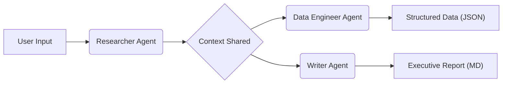

# Agentic Research Squad

> **A multi-agent autonomous system for financial market research, powered by CrewAI and Google Gemini.**


## Overview
The **Agentic Research Squad** is an autonomous AI system designed to simulate a real-world financial analyst team. Unlike standard chatbots that just "chat," this system orchestrates a crew of specialized AI agents who collaborate to research, analyze, and structure complex market data.

It features a **Dual-Pipeline Architecture** that simultaneously produces:
1.  **C-Suite Executive Summaries** (Markdown) for human decision-making.
2.  **Structured Financial Datasets** (JSON/CSV) for downstream machine learning pipelines.

## Architecture
The system employs a sequential process manager to coordinate three specialized agents:

1.  **Senior Researcher:** Utilizes the `SerperDevTool` to scrape real-time web data, focusing on financial metrics (Revenue, Growth, Market Cap) and strategic news.
2.  **Data Engineer:** Transforms unstructured web data into strict, validated JSON formats. Uses **Pydantic** to enforce schema validation, ensuring reliability even with missing or messy data.
3.  **Tech Writer:** Synthesizes the research into a professional executive summary, highlighting key differentiators and strategic outlooks.



## Key Features
* **Multi-Agent Orchestration:** Autonomous task delegation between research, data engineering, and writing roles.
* **Cost-Efficient Inference:** Optimized for **Google Gemini 1.5 Flash**, balancing high analytical reasoning with low latency and cost.
* **Strict Typing & Validation:** Implements **Pydantic** models to enforce output schemas, preventing "hallucinated" data structures common in LLMs.
* **Rate Limit Protection:** Custom `max_rpm` logic to ensure stability within API free-tier constraints.
* **Robust Error Handling:** Uses `Optional` typing to handle missing live metrics gracefully without crashing the pipeline.

## Tech Stack
* **Language:** Python 3.12+
* **Orchestration:** CrewAI
* **LLM Provider:** Google Gemini (via LangChain)
* **Search Tool:** SerperDev API (Google Search Wrapper)
* **Validation:** Pydantic
* **Environment:** Dotenv

## Example

**Input:**
> "Compare the financial outlook of Nvidia vs. AMD"

**Outputs:**
The system will generate two files in your project directory:
* `reports/summary.md`: A full market analysis report.
* `data/metrics.json`: A structured list of financial metrics for ingestion.

## 📂 Project Structure
```text
.
├── main.py              # Core agent logic and orchestration
├── data/                # Generated JSON datasets
├── reports/             # Generated Markdown reports
├── .env                 # API keys (Not uploaded to git)
├── .gitignore           # Git exclusions
├── requirements.txt     # Python dependencies
└── README.md            # Documentation
```
